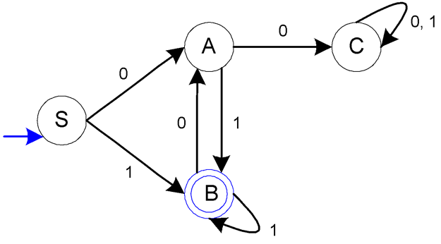

# Praktikum Otomata Kelompok B2

| Nama     | NRP      |
|----------|----------|
| Muhammad Naufal Hadaya Setiawan | 5025241181|
| Isabella Sienna Sulisthio | 5025241199 |
| Akmal Yusuf | 5025241212 |

## Praktikum 1
>Buatlah program computer yang dapat membaca inputan berupa program computer lain, dan dapat menghasilkan output berupa token-token (string-string yang terbaca) dan mengelompokkannya sesuai dengan sifat string tersebut:
    a) Reserve words
    b) Simbol dan tanda baca
    c) Variabel
    d) Kalimat matematika (persamaan, fungsi, dsb)  
Rancanglah user interface sedemikian hingga pengguna dapat mudah menginputkan sebuah program yang akan dicari token2nya.

**Implementasi: https://github.com/IsabellaSienna01/B02_Otomata/tree/main/Praktikum%201** 

## Praktikum 2
> Buatlah program komputer untuk mengotomasi FSM di bawah, yaitu sebuah mesin yang dapat menentukan apakah sebuah string merupakan anggota dari himpunan bahasa L = { x ∈ (0 + 1)+ | dengan karakter terakhir pada string x adalah 1 dan x tidak memiliki substring 00 } 
  
Rancanglah user interface sedemikian hingga pengguna dapat mudah menginputkan string yang akan didentifikasi keanggotaannya.

**Implementasi: https://github.com/IsabellaSienna01/B02_Otomata/tree/main/Praktikum%202**
